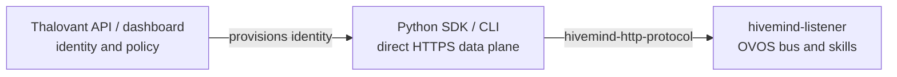

# Thalovant Python SDK

Build Python clients and agents that connect directly to Thalovant HiveMind hubs
over HTTPS.

```bash
pip install thalovant
```

```python
from thalovant import ThalovantClient

with ThalovantClient.from_identity_file("_identity.json") as client:
    reply = client.ask("Tell me a short clean joke.")
    print(reply.text)
```

<div class="thalovant-home-grid" markdown>

[:material-rocket-launch-outline: Quickstart](quickstart.md)
: Verify an identity, run diagnostics, ask the hub, and listen for events.

[:material-account-voice: Agents](guides/conversations-and-agents.md)
: Build long-running sync or async workers with decorators and scoped sessions.

[:material-console: CLI](cli.md)
: Smoke-test hub access with `thalovant doctor`, `ask`, `listen`, and `emit`.

[:material-code-braces: API Reference](api-reference.md)
: Explore clients, conversations, events, diagnostics, and generated reference docs.

</div>

## How It Fits



Thalovant is the control plane. The SDK is the developer convenience layer. It
does not proxy data-plane messages through the Thalovant API.

## Common Workflows

=== "Ask"

    ```python
    from thalovant import ThalovantClient

    with ThalovantClient.from_identity_file("_identity.json") as client:
        print(client.ask("What time is it?").text)
    ```

=== "Conversation"

    ```python
    from thalovant import ThalovantClient

    with ThalovantClient.from_identity_file("_identity.json") as client:
        with client.conversation(lang="en-us") as convo:
            print(convo.ask("Remember that my favorite color is blue.").text)
            print(convo.ask("What color did I mention?").text)
    ```

=== "Agent"

    ```python
    from thalovant import EVENT_SPEAK, ThalovantAgent

    agent = ThalovantAgent.from_identity_file("_identity.json")

    @agent.on(EVENT_SPEAK)
    def handle_speak(event):
        print(event.text)

    agent.run_forever()
    ```

=== "CLI"

    ```bash
    thalovant --identity _identity.json doctor
    thalovant --identity _identity.json ask "Tell me a joke"
    ```

## What The SDK Gives You

- Direct HiveMind HTTP/HTTPS transport using existing HiveMind client identity.
- `ask`, `send_utterance`, `listen`, and `emit` primitives.
- Conversation-scoped session and request correlation.
- Sync and async clients.
- Sync and async long-running agent runners.
- CLI diagnostics and smoke tests.
- Typed package marker for IDEs and type checkers.
